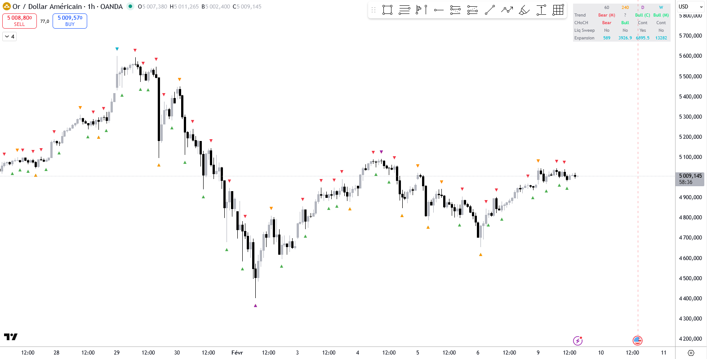

# JCO Swings Trend Multi TF

A TradingView Pine Script v6 indicator that detects swing highs/lows on up to 4 configurable timeframes and determines trend direction based on swing structure.



## Features

- **Multi-timeframe analysis** - 1 primary + 3 optional secondary timeframes
- **Trend detection** - Bullish/Bearish with Momentum or Compression status
- **CHoCH-gated trend reversals** - Prevents premature trend changes by requiring close price confirmation
- **CHoCH detection** - Change of Character for potential reversals
- **Liquidity sweep detection** - With close price confirmation
- **Swing alternation** - Automatic missing swing insertion when consecutive same-type pivots occur
- **Multi-column dashboard** - Real-time overview of all active TF analyses

## Installation

1. Open TradingView and go to the Pine Script Editor
2. Copy the contents of `Indicator_JCO_Swings_Trend_Multi_TF.pine`
3. Paste into the editor and click "Add to chart"

## Parameters

### General (common to all TFs)

| Parameter | Default | Description |
|-----------|---------|-------------|
| Swing Period | 5 | Number of bars for pivot detection (left/right = period/2) |
| Icon Gap | 0.1% | Distance between swing icon and price level |
| Display Dashboard | true | Show/hide the multi-column dashboard |
| Display Expansion | true | Show/hide the expansion row in dashboard |
| Dashboard Border Width | 0 | Border width of the dashboard table |

### TF 1 (Primary - always enabled)

| Parameter | Default | Description |
|-----------|---------|-------------|
| Timeframe | 60 (1H) | Primary analysis timeframe |
| Draw Icons | true | Show swing high/low icons (red/green) |

### TF 2, 3, 4 (Secondary - optional)

| Parameter | Default TF2 / TF3 / TF4 | Description |
|-----------|--------------------------|-------------|
| Enable | false | Enable/disable this timeframe |
| Timeframe | 240 / D / W | Analysis timeframe |
| Draw Icons | true | Show swing icons |
| Icon Color | orange / purple / aqua | Single color for both high and low icons |

## Detection Logic

### 1. Swing Detection & Alternation

Pivots are detected using `ta.pivothigh()` / `ta.pivotlow()` with configurable left/right bars. The indicator enforces **strict alternation** between swing highs and lows:

- Swings must alternate: High, Low, High, Low...
- When two consecutive highs (or lows) are detected, the indicator automatically inserts a **missing swing** by finding the lowest low (or highest high) between the two same-type pivots
- If no missing swing can be inserted and the new pivot extends the current one (higher high or lower low), the current swing is **updated** in place

Each timeframe maintains its own `SwingState` (User-Defined Type) tracking the last 5 swing highs/lows, close prices, labels, and bar indices.

### 2. Trend Detection (`calcSwingsTrend`)

The trend is determined from the 3 most recent swing highs (`sh0, sh1, sh2`) and swing lows (`sl0, sl1, sl2`):

**Bullish patterns** (based on swing lows):
- **Perfect**: `sl2 < sl1 < sl0` (3 consecutive higher lows)
- **Sweep**: `sl2 > sl1` then `sl0 > sl2` (middle low dips below sl2 but last recovers above)
- Both require `sl0 > sl1` (last low higher than previous)

**Bearish patterns** (based on swing highs):
- **Perfect**: `sh2 > sh1 > sh0` (3 consecutive lower highs)
- **Sweep**: `sh2 < sh1` then `sh0 < sh2` (middle high exceeds sh2 but last drops below)
- Both require `sh0 < sh1` (last high lower than previous)

**Ambiguous patterns** - accepted only when opposite swings confirm:
- Ambiguous Bullish + `sh0 > sh1` (highs confirm) -> Bullish
- Ambiguous Bearish + `sl0 < sl1` (lows confirm) -> Bearish

**Status**:
- **Momentum (M)**: Opposite swings confirm the direction (bull + higher highs, or bear + lower lows)
- **Compression (C)**: Direction established but opposite swings don't confirm yet

**Priority**: Primary Bullish > Primary Bearish > Ambiguous Bullish > Ambiguous Bearish > No Direction (?)

### 3. CHoCH - Change of Character (`calcCHoCH`) - Dual Detection

Detects potential trend reversals using **dual detection**: both bullish and bearish CHoCH are evaluated simultaneously. Requires both **price break** and **close confirmation**:

**CHoCH Bullish** conditions:
1. `sh0 > sh1` - New higher high (price break)
2. `sh0Close > sh1` - Close confirms above previous high
3. Previous highs were declining (`sh1 < sh2`) OR previous trend was not bullish

**CHoCH Bearish** conditions:
1. `sl0 < sl1` - New lower low (price break)
2. `sl0Close < sl1` - Close confirms below previous low
3. Previous lows were rising (`sl1 > sl2`) OR previous trend was not bearish

**Dual CHoCH resolution**: When both bullish and bearish structural conditions are true simultaneously, the **most recent swing** wins:
- Last swing was a high (`lastWasHigh`) -> CHoCH Bullish wins
- Last swing was a low -> CHoCH Bearish wins
- If the winning CHoCH matches `prevDir` (e.g., CHoCH Bullish but already bullish), the opposing CHoCH was a **liquidity sweep** -> `chochLiqSweep = true`

The close price used is the **best close in a 5-candle window** around the pivot (max close for highs, min close for lows), providing more robust confirmation than a single candle's close.

### 4. Gated Trend Change (`gateTrendChange`)

Prevents premature trend reversals by requiring CHoCH confirmation before accepting a direction change:

**Dual CHoCH liquidity sweep** (highest priority): When `chochLiqSweep` is true (dual CHoCH detected and most recent matches previous direction), the previous trend is restored as **Momentum** and liquidity sweep is flagged.

**When raw trend reverses from previous direction:**

| Previous | Raw | CHoCH confirms? | Larger structure holds? | Result |
|----------|-----|-----------------|------------------------|--------|
| any | any | Dual CHoCH liq sweep | - | **prevDir (M)** + liq sweep |
| Bullish | Bearish | Yes (CHoCH Bearish) | - | **Bearish** (accept) |
| Bullish | Bearish | No | `sh0 > sh3` | **Bullish (C)** (maintain) |
| Bullish | Bearish | No | `sh0 <= sh3` | **? (unknown)** |
| Bearish | Bullish | Yes (CHoCH Bullish) | - | **Bullish** (accept) |
| Bearish | Bullish | No | `sl0 < sl3` | **Bearish (C)** (maintain) |
| Bearish | Bullish | No | `sl0 >= sl3` | **? (unknown)** |

When the trend is maintained without CHoCH, the status is forced to **Compression (C)** to signal the structure is under pressure.

When no reversal occurs (same direction or no direction), the raw trend passes through unchanged.

### 5. Liquidity Sweep (`calcLiquiditySweep`)

Detects when price sweeps beyond a previous swing level then reverses, suggesting institutional liquidity collection:

**Bullish liquidity sweep** (in bullish trend):
- Case 1: Previous low broke structure (`sl1 < sl2`) but price recovered (`sl0 > sl1, sh0 > sh1`)
- Case 2: Current low broke previous (`sl0 < sl1`) but close recovered above (`slClose0 > sl1`) or highs confirm (`sh0 > sh1`)

**Bearish liquidity sweep** (in bearish trend):
- Case 1: Previous high broke structure (`sh1 > sh2`) but price reversed down (`sh0 < sh1, sl0 < sl1`)
- Case 2: Current high broke previous (`sh0 > sh1`) but close rejected below (`shClose0 < sh1`) or lows confirm (`sl0 < sl1`)

Liquidity sweep is the **union** of two sources:
- **Gated liquidity sweep**: from dual CHoCH detection (opposing CHoCH was a liquidity sweep)
- **Structural liquidity sweep**: from `calcLiquiditySweep` using the gated (confirmed) trend direction

### 6. Expansion

Measures the distance between the most recent swing high and swing low in pips:

```
Expansion = (ph_0 - pl_0) / pipSize
```

Where `pipSize = syminfo.mintick * 100`. Display can be toggled on/off.

## Dashboard

The dashboard displays a multi-column table in the top-right corner:

```
|           | 60   | 240  | D    | W    |
|-----------|------|------|------|------|
| Trend     | Bull (M) | Bear (C) | ?    | OFF  |
| CHoCH     | Cont | Bear | Cont | OFF  |
| Liq Sweep | No   | Yes  | No   | OFF  |
| Expansion | 42.5 | 128.3| N/A  | OFF  |
```

- **Active TFs**: Color-coded values (green=bullish, red=bearish, gray=neutral)
- **Disabled TFs**: "OFF" in gray
- **Invalid TFs** (chart TF > swing TF): "N/A" in gray

## Alerts

Hidden plots are available for TradingView alerts on each TF:
- `Trend Direction TF1..4` (1=Bullish, -1=Bearish, 0=None)
- `CHoCH Status TF1..4` (1=Bullish, -1=Bearish, 0=Continuation)
- `Liquidity Sweep TF1..4` (1=Yes, 0=No)

## Known Limitations

- `max_labels_count=500` shared across all TFs (~125 labels per TF with 4 active)
- `request.security()` is always executed for all 4 TFs regardless of enable/disable (Pine Script limitation). The toggle saves on processing, not on the security call.
- Maximum 40 `request.security()` calls per indicator (this uses 4)
- Chart timeframe must be <= swing timeframe for valid results

## Changelog

### v2.2 - 2026-02-10
- Dual CHoCH detection: detects both bullish and bearish CHoCH simultaneously
- When both CHoCH exist, most recent swing wins; if it matches prevDir -> liquidity sweep
- `gateTrendChange`: dual CHoCH liquidity sweep restores previous trend as Momentum
- Liquidity sweep combines gated (dual CHoCH) + structural detection
- Aligned with single-TF version (JCO Swings Trend HTF v1.3)

### v2.1 - 2025-02-08
- Add `gateTrendChange`: trend reversals now require CHoCH confirmation (close price break)
- Without CHoCH, trend stays if larger structure holds (`sh0>sh3` / `sl0<sl3`), else unknown
- Liquidity sweep now uses gated (confirmed) direction instead of raw direction

### v2.0 - 2025-02-07
- Multi-timeframe support: 4 TFs (1 primary + 3 optional secondary)
- `SwingState` UDT with `processAlternation()` method for per-TF state
- Simplified `getPivotsHTF()` to return 4 values (was 12)
- Multi-column dashboard (labels + 4 TF columns)
- TF1: red/green icons (hardcoded); TF2-4: single configurable color per TF
- Removed SH/SL values display from dashboard
- Expansion display as toggle parameter

### v1.0 - 2025-01-01
- Initial release: single-timeframe swing/trend analysis
- Trend detection with Momentum/Compression status
- CHoCH and liquidity sweep detection
- Dashboard with trend, CHoCH, liquidity sweep, expansion

## License

This code is subject to the terms of the [Mozilla Public License 2.0](https://mozilla.org/MPL/2.0/).
